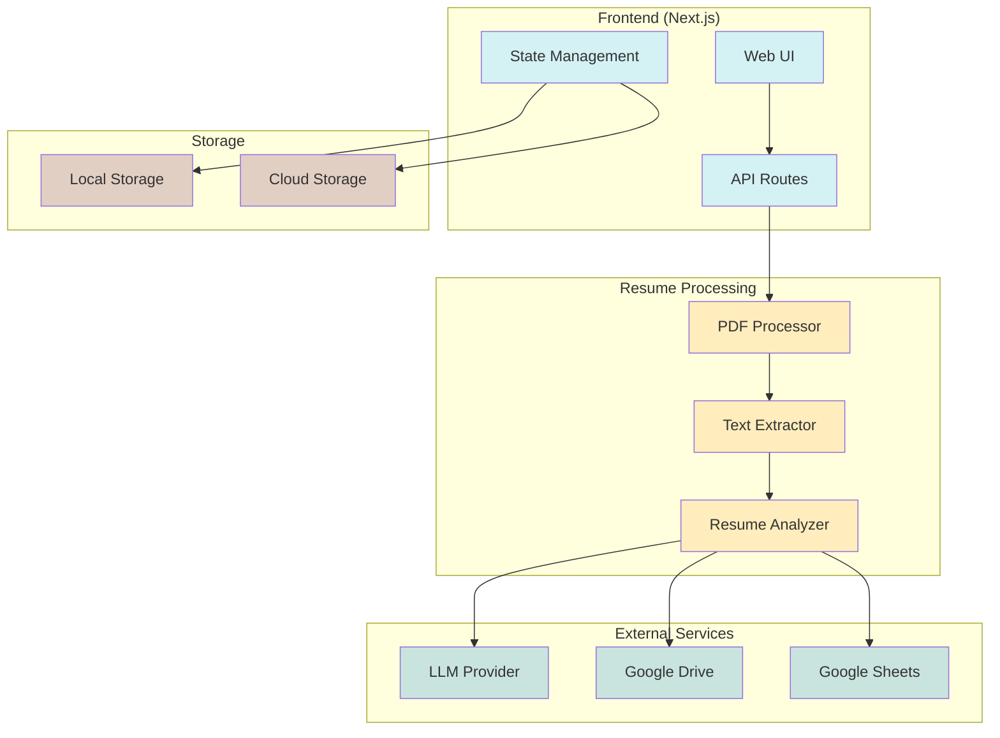
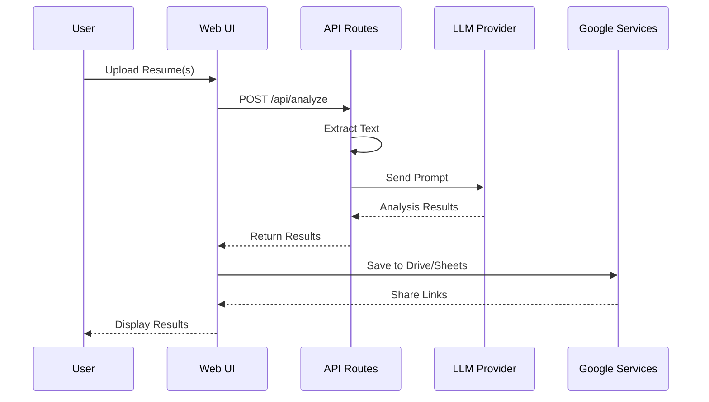

# Resume Analyzer Architecture

## System Overview



## Component Structure

```mermaid
graph TD
    subgraph "UI Components"
        Landing[Landing Page]
        Playground[Playground]
        Bulk[Bulk Analysis]
        Nav[Navigation]
        Upload[File Upload]
        Progress[Progress Bar]
        Results[Results View]
    end

    subgraph "API Layer"
        Analyze[/api/analyze]
        Drive[/api/drive]
        Sheets[/api/sheets]
    end

    subgraph "Services"
        PDFService[PDF Service]
        LLMService[LLM Service]
        GoogleService[Google Service]
    end

    Landing --> Nav
    Landing --> Playground
    Landing --> Bulk
    Playground --> Upload
    Playground --> Results
    Bulk --> Upload
    Bulk --> Progress
    Bulk --> Results

    Upload --> Analyze
    Results --> Drive
    Results --> Sheets

    Analyze --> PDFService
    Analyze --> LLMService
    Drive --> GoogleService
    Sheets --> GoogleService

    classDef component fill:#d4f1f4
    classDef api fill:#ffedbd
    classDef service fill:#c9e4de

    class Landing,Playground,Bulk,Nav,Upload,Progress,Results component
    class Analyze,Drive,Sheets api
    class PDFService,LLMService,GoogleService service
```

## Data Flow



## Directory Structure

```
resume-analyzer/
├── src/
│   ├── app/
│   │   ├── page.tsx                 # Landing page
│   │   ├── playground/
│   │   │   └── page.tsx            # Single analysis
│   │   ├── bulk/
│   │   │   └── page.tsx            # Bulk analysis
│   │   └── api/
│   │       ├── analyze/
│   │       ├── drive/
│   │       └── sheets/
│   ├── components/
│   │   ├── ui/                     # shadcn components
│   │   ├── shared/                 # Common components
│   │   └── analysis/               # Analysis specific
│   └── lib/
│       ├── utils.ts                # Utilities
│       ├── pdf.ts                  # PDF processing
│       └── google.ts               # Google integration
└── public/
    └── assets/                     # Static assets
```

## Integration Points

### LLM Providers

- Local LLM (default)
- Gemini
- OpenRouter
- Custom endpoints

### Google Services

- Drive API for file storage
- Sheets API for results
- Auth for access control

### Storage Options

- Local filesystem
- Google Drive
- Custom cloud storage

## Configuration

Key configuration options are managed through environment variables:

```env
# LLM Configuration
LLM_PROVIDER=local|gemini|openrouter
LLM_ENDPOINT=http://localhost:1234
LLM_API_KEY=your_api_key

# Google Configuration
GOOGLE_DRIVE_FOLDER_ID=folder_id
GOOGLE_SHEETS_ID=sheet_id
GOOGLE_CLIENT_ID=client_id
GOOGLE_CLIENT_SECRET=client_secret

# App Configuration
NEXT_PUBLIC_API_URL=http://localhost:3000/api
```
